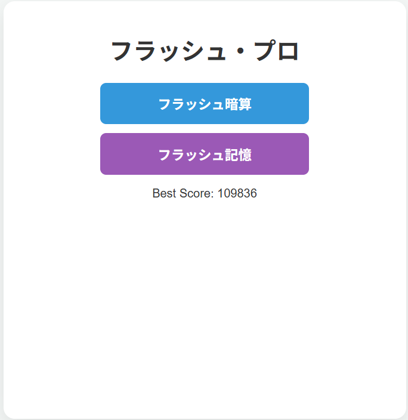
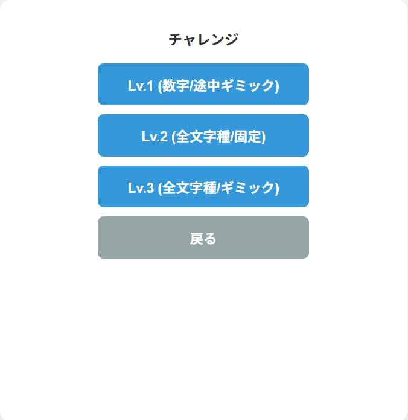
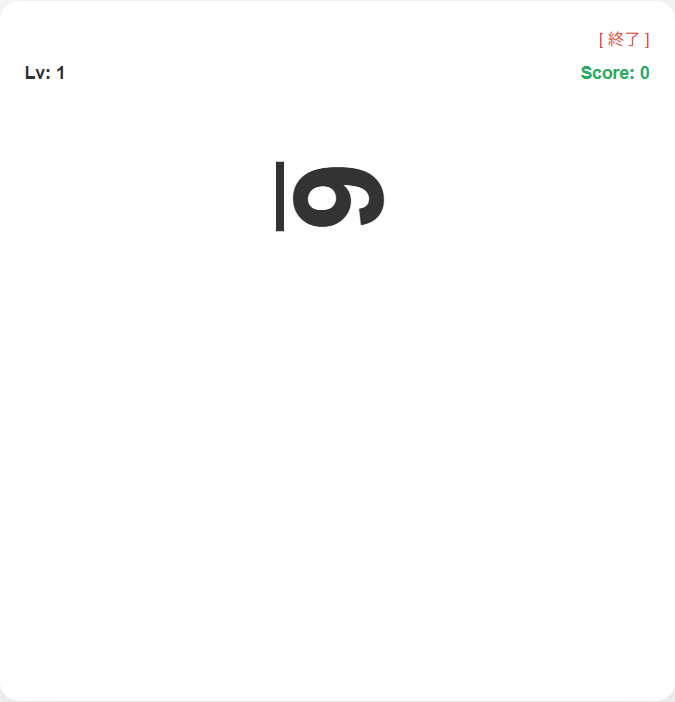
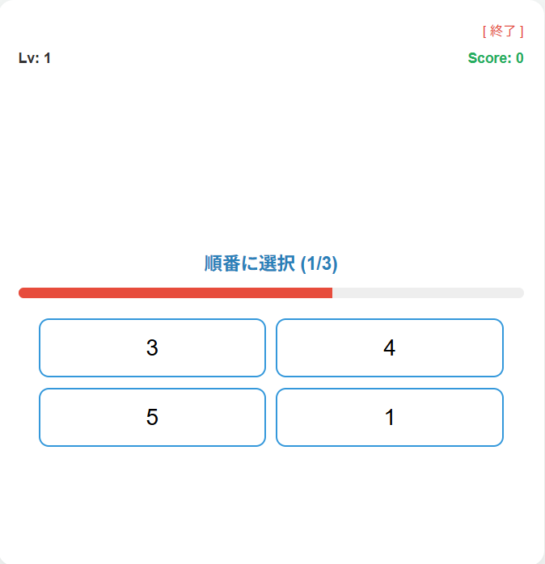

# フラッシュ暗算系のゲーム

## 概要
数字を瞬間的に記憶・計算するフラッシュ暗算ゲームです。
Spring Bootを用いたWebアプリとして開発し、
ユーザー認証・スコア保存・ランキング機能を実装しています。

## デプロイURL
https://my-java-app-q9xd.onrender.com
 ※無料のRenderを使用しているため、15分以上のアクセスがないと起動時に1分弱のロード時間がかかります。

## 使用技術

 ■ バックエンド
- Java
- Spring Boot
- Spring MVC
- Spring Security

 ■ フロントエンド
- JavaScript
- HTML / CSS

 ■ データベース
- MySQL / PostgreSQL

 ■ インフラ・開発ツール
- Git / GitHub
- Render

## 実装機能
- ユーザー登録機能
- ログイン認証機能
- パスワードハッシュ化
- スコア保存機能
- ランキング機能
- DBによるデータ永続化

## ゲーム機能
### ■ モード
- 暗算モード（表示された数字の合計を回答）
- 記憶モード（表示された数字の順番を回答）

### ■ 難易度
- 複数レベル（表示速度・難易度が変化）

### ■ スコア機能
- チャレンジモードでスコア計測機能あり

- ## 📷 スクリーンショット

- ゲーム画面

<table>
  <tr>
    <td></td>
    <td></td>
  </tr>
  <tr>
    <td></td>
    <td></td>
  </tr>
</table>

## 工夫した点
- ゲームモードを分けて、異なる認知能力（計算力・記憶力）を鍛えられる設計にした
- レベル制を導入し、難易度調整を可能にした
- 一桁の数字しか出したくなかったので、左右反転や90度傾けて表示などで難易度アップするようにした
- 漢数字などを混ぜることによる難易度アップするようにした
- PCのクリック操作だけでなく、スマートフォンのタップ操作でも遊べるよう4択形式を採用
- スマホブラウザでも快適にプレイできるUIを意識した
- MVC構成を意識してフロント・バックエンドを分離

## 苦労した点
- ローカル環境では正常動作していたが、Renderへのデプロイ時に環境差異によるエラーが発生
- ログを確認しながらDB接続設定や環境変数を調整し、原因を切り分けて解決した
- 本番環境を意識した設定管理の重要性を学んだ

## 今後の改善案
- 入力バリデーション強化やUI改善、ランキング更新処理の最適化など。

- ## 学んだこと
- Spring Bootを用いたWebアプリ開発の流れ
- 認証機能やDB連携の実装
- デプロイ時の環境差異への対応
- ユーザーが遊びやすいUI設計

